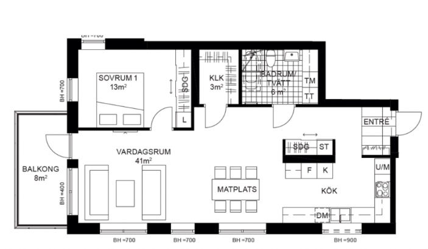

# Plan Risk Movil

Aplicacion movil multiplataforma desarrollada con Flutter para la visualizacion interactiva de planos arquitectonicos en 3D y evaluacion de riesgos en proyectos de construccion, impulsada por inteligencia artificial.

---

## Descripcion del Proyecto

Plan Risk Movil es la herramienta definitiva para profesionales de la construccion, ingenieros y gestores de proyectos. Esta aplicacion permite llevar el poder del analisis 3D y la prevencion de riesgos directamente en el dispositivo movil.

### Capacidades Destacadas:
- Visualizacion 3D Avanzada: Renderizado fluido de modelos en formato .glb.
- Evaluacion con IA: Analisis automatico de riesgos usando la API de Gemini.
- Presupuestos Inteligentes: Generacion y exportacion de presupuestos y analisis de costos.
- Sincronizacion en Tiempo Real: Conectado directamente al backend Django.
- Seguridad y Autenticacion: Inicio de sesion protegido con JWT, recuperacion de contraseñas y gestion de perfiles.
- Multiplataforma: Listo para compilar en iOS, Android y Web.

---

## Tecnologias Utilizadas

- Framework: Flutter 3.9+
- Lenguaje: Dart 3.9+
- Gestion de Estado: GetX 4.6+
- Visualizacion 3D: model_viewer_plus 1.9+
- Almacenamiento Local: GetStorage 2.1+, Shared Preferences 2.5+
- Diseño: Material Design 3 (con soporte automatico para temas Claro/Oscuro)
- Tipografia: Google Fonts (Inter, Roboto)

---

## Arquitectura del Proyecto (MVVM con GetX)

El proyecto sigue una arquitectura limpia basada en el patron MVVM (Model-View-ViewModel) estructurado mediante GetX para una separacion clara entre la interfaz grafica y la logica de negocio.

```text
lib/
├── api/          # Conexion al servidor (AuthService, etc.)
├── config/       # Temas, colores y estilos de texto
├── const/        # Variables globales y constantes (ej. endpoints)
├── model/        # Modelos de datos puros
├── routes/       # Definicion del enrutamiento de la app
├── screens/      # Modulos de vistas
│   ├── auth/     # Login, Registro, Recuperacion de contraseña
│   ├── dasboard/ # Panel principal y estadisticas
│   ├── main/     # Estructura principal y Sidebar
│   └── splash/   # Pantalla de carga inicial
└── widgets/      # Componentes reutilizables (inputs, botones, cards)
```

---

## Flujo de Trabajo: De 2D a 3D

La aplicacion permite a los usuarios transformar un plano bidimensional estandar en un modelo tridimensional interactivo con funcionalidades completas. El proceso es el siguiente:

1. **Importacion del Plano:** El usuario selecciona o toma una foto de un plano 2D desde su dispositivo movil.
   
2. **Procesamiento de IA:** El backend procesa la imagen, detecta las paredes, puertas y estructuras utilizando el modelo Mask R-CNN pre-entrenado.
3. **Generacion 3D:** Se genera un modelo estructural completo en formato `.glb`.
4. **Visualizacion e Interaccion:** El usuario puede rotar, hacer zoom y recorrer el modelo 3D directamente desde su celular, ademas de obtener un reporte de estimacion de riesgos asociados a la estructura detectada.

---

## Instalacion y Despliegue

### Requisitos Previos
- Flutter SDK >= 3.9.0
- Dart SDK >= 3.9.0
- Git
- Python (Para el backend local)

### Pasos de Instalacion y Ejecucion

1. Clonar el repositorio:
   ```bash
   git clone <url-repositorio>
   cd Plan_Risk_Movil
   ```

2. Obtener las dependencias:
   ```bash
   flutter pub get
   ```

3. Configurar la conexion al Backend Local:
   Para que la aplicacion movil pueda comunicarse con tu computadora local, debes crear un archivo .env en la raiz del proyecto.
   En este archivo, debes usar la direccion IP local (IPv4) de tu computadora (por ejemplo, 192.168.0.7), no localhost ni 127.0.0.1.
   
   Ejemplo del archivo .env:
   ```env
   BASE_URL=http://192.168.0.7:8000/
   ```

4. Ejecutar el Backend (Django):
   Es obligatorio que el servidor backend acepte conexiones externas en tu red local. Para esto, en la terminal del backend ejecuta:
   ```bash
   python manage.py runserver 0.0.0.0:8000
   ```
   Nota: Si te da error de hosts, agrega tu IP a la variable ALLOWED_HOSTS en el archivo settings.py del backend.

5. Ejecutar la aplicacion movil (Desarrollo):
   ```bash
   flutter run
   ```

---

## Comandos Utiles de Flutter

Compilar para Produccion:
- Android (APK): flutter build apk --release
- Android (Bundle para Play Store): flutter build appbundle --release
- iOS: flutter build ios --release
- Web: flutter build web --release

Mantenimiento:
- Limpiar cache: flutter clean
- Analizar codigo: flutter analyze
- Formatear codigo: dart format lib/

---

## Contribuciones y Licencia

Desarrollado y mantenido por Fournext Team.
Todos los derechos reservados.

Para soporte tecnico o consultas, contactar al equipo de desarrollo interno.
